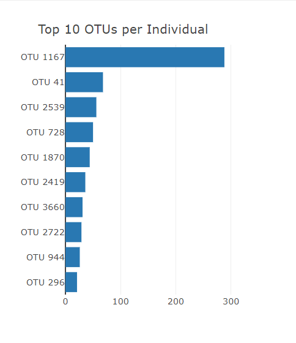
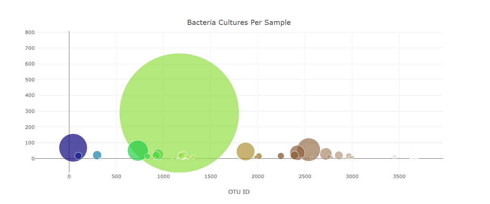
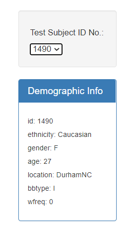
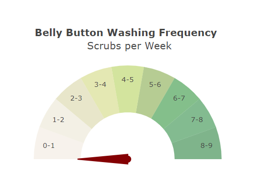
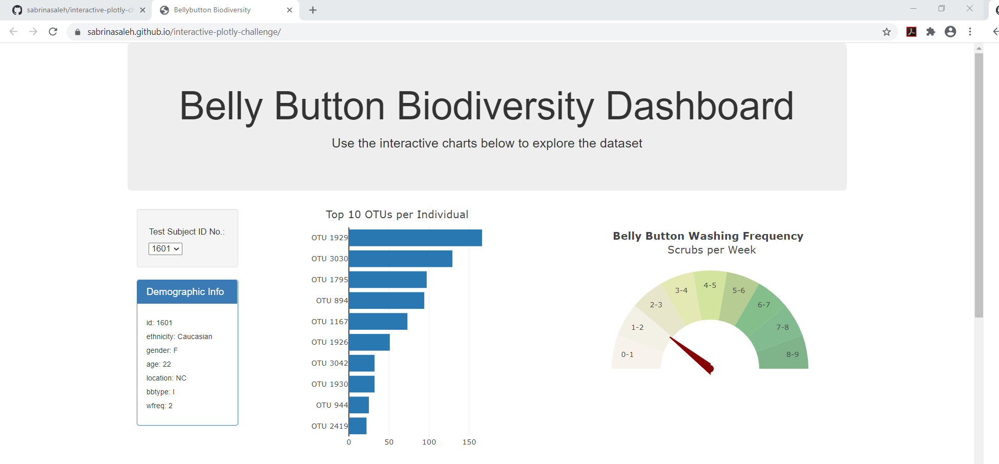
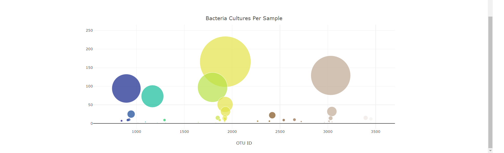

# Interactive Plotly Challenge: Belly Button Biodiversity
https://sabrinasaleh.github.io/interactive-plotly-challenge/

In this assignment, you will build an interactive dashboard to explore the [Belly Button Biodiversity dataset](http://robdunnlab.com/projects/belly-button-biodiversity/), which catalogs the microbes that colonize human navels.

The dataset reveals that a small handful of microbial species (also called operational taxonomic units, or OTUs, in the study) were present in more than 70% of people, while the rest were relatively rare.

## Step 1: Plotly

1. Use the D3 library to read in `samples.json`.

2. Create a horizontal bar chart with a dropdown menu to display the top 10 OTUs found in that individual.

* Use `sample_values` as the values for the bar chart.

* Use `otu_ids` as the labels for the bar chart.

* Use `otu_labels` as the hovertext for the chart.

* **Screen Shot of the Bar Chart for ID# 1490** 

    
  
3. Create a bubble chart that displays each sample.

* Use `otu_ids` for the x values.

* Use `sample_values` for the y values.

* Use `sample_values` for the marker size.

* Use `otu_ids` for the marker colors.

* Use `otu_labels` for the text values.

* **Screen Shot of the Bubble Chart for ID# 1490** 

    
    
4. Display the sample metadata, i.e., an individual's demographic information.

5. Display each key-value pair from the metadata JSON object somewhere on the page.

6. Update all of the plots any time that a new sample is selected.

* **Screen Shot of the Demographic Information for ID# 1490** 

    

## Advanced Challenge Assignment (Optional)

The following task is advanced and therefore optional.

* Adapt the Gauge Chart from <https://plot.ly/javascript/gauge-charts/> to plot the weekly washing frequency of the individual.

* You will need to modify the example gauge code to account for values ranging from 0 through 9.

* Update the chart whenever a new sample is selected.

* **Screen Shot of the Gauge Chart for ID# 1490** 

    
    
## Deployment

* Deploy your app to a free static page hosting service, such as GitHub Pages. Submit the links to your deployment and your GitHub repo.
https://sabrinasaleh.github.io/interactive-plotly-challenge/

* **Screen Shot of Deployment for ID# 1601**
    
    
    
    
## About the Data

Hulcr, J. et al.(2012) _A Jungle in There: Bacteria in Belly Buttons are Highly Diverse, but Predictable_. Retrieved from: [http://robdunnlab.com/projects/belly-button-biodiversity/results-and-data/](http://robdunnlab.com/projects/belly-button-biodiversity/results-and-data/)

## Technologies for Assignment

* HTML
* Bootstrap
* Javascript
* D-3
* Plotly
